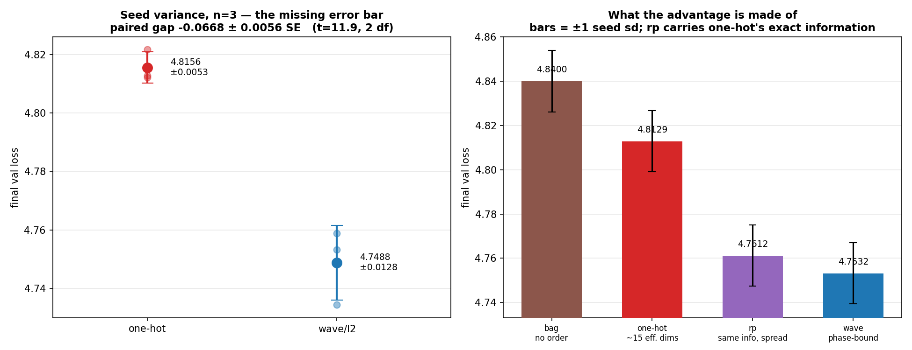
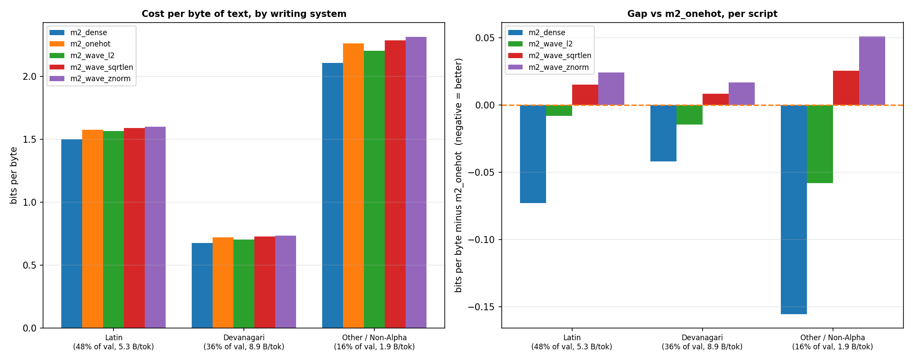

# Kronecker V2 — Removing the Byte-Window Limit

**Assignment problem solved: #3** — *"Today Kronecker is limiting to presenting 32 positions for every word… That's a waste of space. How can it be dynamic and not force us to crop a word?"*

**[→ Interactive walkthrough](https://abi2024.github.io/kronecker_v2/)** — type a word, watch it get cropped, see why anagrams break plain addition.

> **The claim, in one sentence.** The one-hot byte×position grid imposes a hidden design constraint on the tokenizer — *no token may exceed `pos_dim` bytes* — and where that constraint is violated it merges distinct words into one vector permanently; replacing the grid with a phase-bound Fourier code removes the ceiling, and does so with **four times fewer parameters** than the grid needs at its own best setting.

| | |
|---|---|
| **Headline, over 3 seeds** | phase code beats the grid by **0.0668 ± 0.0056** nats at matched parameters (t = 11.9) |
| **Efficiency** | at 589,824 parameters it beats the grid's *own best* (2,359,296 params) by **0.0922 nats**, 6.6 sd |
| **Mechanism, causal** | collisions cost the grid **0.344 ± 0.014** nats on affected positions; effect **vanishes at zero dose** (0.3σ) |
| **Mechanism, honest** | **81%** of the aggregate gain is representational spread, not the Fourier construction |
| **Compute** | one RTX 3060, ~20 GPU-hours total. No frontier hardware anywhere in this repo. |

Evidence sheets: [M1](results/M1_FINDINGS.md) · [M2](results/M2_FINDINGS.md) · [M4/M5](results/M4_M5_FINDINGS.md)

---

## 1. Why Problems 3 and 4 have one answer

Problem 4 asks for a Fourier alternative — *represent each character as a wave and add them to make a word*. Taken literally it fails on the first example: addition is commutative, so `dog` and `god` produce the identical vector, and so does every anagram. Order must enter through something other than the sum, and the natural choice is to **rotate each character's wave by its position**. Rotation has no ceiling — position 47 is just "rotate 47 times as far."

The repair that makes Problem 4 work is the repair that removes Problem 3's length limit. This is one solution to Problem 3, whose mechanism is the construction Problem 4 gestures at.

**This is not a rhetorical point — it is measured.** §6 trains the bag-of-bytes version (same phasors, rotation removed): it scores **4.8400**, *worse* than the grid it was meant to improve on. Order binding is load-bearing.

---

## 2. What the 32-byte window costs

The codec sees only a token's first `pos_dim` bytes. Two tokens sharing that prefix get the *same* vector for the life of the model: the codec is frozen and the projection is shared, so no amount of training separates them.

### Finding 1 — the window is a tokenizer design constraint, not a free parameter

| pos_dim | collision groups | tokens merged | % of vocab |
|--------:|-----------------:|--------------:|-----------:|
| 12 | 1,877 | 5,335 | 4.070% |
| **16** | **380** | **903** | **0.689%** |
| 20 | 131 | 303 | 0.231% |
| 24 | 39 | 93 | 0.071% |
| 32 | 0 | 0 | 0.000% |

Zero at 32 is **not a null result**. BrahmicTokenizer-131K's own audit reports `tokens > 32 bytes: 0` — the vocabulary was *built* to satisfy the window, which we reproduce independently from `tokenizer.json`. The constraint never disappeared; it was **paid for upstream**, as a restriction on which merges the tokenizer may learn, and it appears nowhere in the embedding's parameter accounting.

The bold row is the setting the reference paper's own 124M experiments use. There, it is violated.

### Finding 2 — the cost falls almost entirely on Indic scripts

At `pos_dim = 16`: Malayalam loses 182 of 1,797 tokens (**10.13%**), Devanagari 253 of 4,020 (6.29%), Tamil 5.69%, Telugu 5.56%, Bengali 4.66% — against **18 of 108,185 Latin tokens (0.02%)**.

UTF-8 charges 1 byte per Latin character and **3 per Indic character**; a conjunct such as क्ष is three codepoints, so nine bytes for one visual symbol. Representative groups — three unrelated words, one vector:

```
कार्य (work) / कार्यक्रम (programme) / कार्यालय (office)
अधिकार (right) / अधिकारी (officer) / अधिकारियों (officers)
```

### Finding 3 — a second collision mechanism, independent of the window

The reference `token_id_to_bytes` resolves ids through `tokenizer.decode()`, which renders every partial-codepoint byte-fallback token as U+FFFD. Those tokens collapse together at **any** `pos_dim`: **1,151 tokens still collide at `pos_dim = 32`**, where truncation contributes nothing. A defect in the byte-extraction path, not the codec; the audit reports both sources so they are never conflated.

---

## 3. The fix

Replace *"which of `pos_dim` slots?"* with *"how much rotation?"*

1. Every byte **value** gets a fixed random vector of angles — a phasor.
2. Byte **position** `p` enters as a rotation: the position phasor raised to the power `p`.
3. **Bind** value to position by adding angles, **bundle** across bytes by summing, then normalise.

`p` is an exponent, not an index, so there is no last slot to fall off. The codec stays frozen exactly as in V1; only the shared projection trains.

Prior art this rests on: Plate's Holographic Reduced Representations and fractional power encoding, over `torchhd`. The novelty claimed is narrow: *a phase-bound Fourier byte code as the token-embedding replacement inside a transformer LM.*

---

## 4. Evidence layer 1 — measurement, no training

```bash
python experiments/m1_collision_audit.py --byte-source both
python experiments/m1_separation_demo.py
```

The tables in §2, plus a direct demonstration that the phase code separates what the grid merges, at identical width:

| pair | one-hot @16 | wave @2048 |
|---|---|---:|
| कार्य / कार्यक्रम | **IDENTICAL** | 0.7609 |
| सरकार / सरकारी | **IDENTICAL** | 0.9130 |
| अधिकार / अधिकारी | **IDENTICAL** | 0.9293 |

Separated but still **near** — orthographic locality, the property that made Kronecker work at all, is preserved.

---

## 5. Evidence layer 2 — a controlled comparison, with an error bar

Five arms, 6-layer model, 98M tokens (~50% English, ~50% Hindi). **Only the embedding module differs**: same tokenizer, body, schedule and batch order, verified by an identical `body_state_hash` across arms.


| arm | final val | vs baseline | embedding params |
|---|---:|---:|---:|
| dense table *(reference, **not** matched)* | 4.5592 | −5.27% | 50,331,648 |
| **wave / l2** | **4.7532** | **−1.24%** | 1,572,864 |
| one-hot @16 *(baseline)* | 4.8129 | — | 1,572,864 |
| wave / sqrt_len | 4.8612 | +1.00% | 1,572,864 |
| wave / znorm | 4.9023 | +1.86% | 1,572,864 |

### Finding 4 — the result survives three seeds, and one earlier claim does not

Every number in this project was `n=1` until seed variance was measured directly.



| arm | mean over 3 seeds | sd |
|---|---:|---:|
| one-hot | 4.8156 | 0.0053 |
| wave / l2 | 4.7488 | 0.0128 |

**Paired gap −0.0668 ± 0.0056 SE, t = 11.9 (2 df).** The headline survives, and the true gap is slightly *larger* than the single seed showed. That number then recalibrates everything else:

| claim | effect / noise | |
|---|---:|---|
| wave beats one-hot | 11.9 sd | survives |
| one-hot depends on pos_dim | 12.4 sd | survives |
| wave768 beats one-hot's best | 6.6 sd | survives |
| **wave "insensitive to pos_dim"** | **1.5 sd** | **not resolved** |

Wave's spread across `pos_dim` was 0.0195 against a seed noise of 0.0128. An earlier finding that smaller wave codes are monotonically better was **inside the noise**, and is withdrawn.

---

## 6. Evidence layer 3 — what the advantage is actually made of

An aggregate cannot say *why*. Two ablations complete a 2×2, each holding one property fixed:

- **`rp`** passes the one-hot code through an invertible Gaussian matrix. **Identical information** — collisions and truncation included — but spread across ~1,436 effective dimensions instead of ~15. Isolates spread.
- **`bag`** uses the same frozen phasors and bundling but drops the position rotation. Same spread, no order. Isolates binding.

| arm | val | what it has |
|---|---:|---|
| bag | 4.8400 | many effective dims, **no order** |
| one-hot | 4.8156 | **~15 effective dims** of 4,096, order |
| **rp** | **4.7612** | ~1,436 dims, order, **one-hot's exact information** |
| wave | 4.7488 | ~997 dims, order, unbounded length |

```
spread alone    one-hot → rp    −0.0544    81% of wave's total gain    3.9 sd
order alone     wave → bag      +0.0912    catastrophic                6.6 sd
residual        rp → wave       −0.0124    0.9 sd — NOT RESOLVED
```

### Finding 5 — most of the aggregate gain is spread, not Fourier structure

**81% of the phase code's advantage is recovered by spreading the grid's own information across more dimensions.** At matched width, `rp` and `wave` are **statistically indistinguishable** (0.9 sd). This deflates the obvious reading of the earlier results, and belongs in the paper exactly as stated.

### Finding 6 — but the phase code doesn't need the width


| | best setting | embedding params | val |
|---|---|---:|---:|
| one-hot | pos_dim 24 | 2,359,296 | 4.8074 |
| **wave** | **d_complex 768** | **589,824** | **4.7152** |

**−0.0922 nats using 4× fewer parameters (6.6 sd)**, and wave@768 beats `rp`@4096 by 0.046 (3.3 sd). Random projection buys spread but still needs 4,096 dimensions; the phase construction reaches it in 1,536. The two curves do not overlap: one-hot's *best* is worse than wave's *worst*.

---

## 7. Evidence layer 4 — the collision mechanism, tested causally

Bucketing by the **target** token showed no collision effect at all. That contradiction located an error: the `lm_head` is untied and dense, so a collided token stays perfectly scoreable *as an answer*. A collision corrupts a token *as context* — what degrades is the prediction of **whatever follows**.


Re-bucketing by the preceding input token, the effect is **11× larger**. Attribution then needs a control, because positions after collided tokens are also after *long*, *Indic*, *common* tokens. The control is long Indic tokens that are also cropped but stay **unique**; the difference-in-differences cancels what the groups share.


### Finding 7 — the effect scales with dose and vanishes at zero

`pos_dim` is a dial with a known dose. The treatment set is held **fixed** — the same 903 tokens across all four models — so the only thing that varies is whether the codec merges them.


| pos_dim | of the set merged | DiD | σ |
|---:|---:|---:|---:|
| 12 | 100% | −0.7226 | 46.3 |
| 16 | 100% | **−0.3436** | 24.8 |
| 24 | 10.3% | −0.0333 | 2.4 |
| **32** | **0%** | **+0.0045** | **0.3** |

**At zero dose the effect is 0.3σ — indistinguishable from nothing.** It is also near-linear in dose: at 10.3% of the set merged the effect is 9.7% of full size, within 1.3 percentage points of exact proportionality. `pos_dim=32` is a placebo the *tokenizer* built, not one we chose.

A methodological note kept in the record: the first version of this analysis defined the control as "distinct at `pos_dim=16`", and **588 of those 887 tokens are themselves merged at `pos_dim=12`** — the control was two-thirds treated, which suppressed p12's estimate and produced a spurious 3.7σ placebo residual. The corrected control requires distinctness at the *narrowest* window, which is monotone and so guarantees it everywhere; a `control_merged` column verifies this per model.

---

## 8. The Indic claim, measured directly

Reported in **bits per byte** — a Devanagari token covers 8.91 UTF-8 bytes against Latin's 5.31, so per-token loss is not comparable across scripts.



| script | one-hot BPB | wave/l2 BPB | relative |
|---|---:|---:|---:|
| Latin | 1.5732 | 1.5652 | **−0.51%** |
| Devanagari | 0.7180 | 0.7036 | **−2.01%** |

**Four times the relative improvement on Devanagari as on Latin.** Framed as how much of a dense table's advantage the codec recovers: **10.9% on Latin, 34.3% on Devanagari.**

All three normalizations show the same Indic-specific edge (−0.0064 / −0.0067 / −0.0075) even though two of them *lose* overall — the Indic benefit belongs to the codec family, the aggregate to the normalization.

*Limits:* cross-script BPB levels are corpus-confounded (Sangraha is plausibly more templated than FineWeb-Edu), and only Devanagari is testable in an English+Hindi corpus — so the worst-hit script, Malayalam, is currently unmeasurable. M3 adds it.

---

## 9. What is claimed, and what is not

**Claimed.**
- At `pos_dim=16`, 903 tokens receive permanently identical codes, ~98% of them Indic; the 32-byte window holds only because the tokenizer was co-designed to make it hold.
- The phase code beats the grid by 0.0668 ± 0.0056 nats over three seeds, and by 0.0922 nats using **4× fewer parameters** at each side's best setting.
- Collisions cost the grid 0.344 nats on affected positions; the effect scales with dose and is 0.3σ at zero dose.
- Per script, the codec recovers 34.3% of a dense table's advantage on Devanagari against 10.9% on Latin.

**Not claimed.**
- **That the Fourier construction explains the aggregate gain.** It does not — 81% is representational spread, and at matched width a random projection of the grid's own information is statistically indistinguishable from the phase code.
- **That this beats a dense table.** It does not: dense is 4.08% better, with **32×** the embedding parameters.
- That any of it holds at frontier scale. One model size, one token budget, three seeds on one pair only, one language pair, one metric.
- That validation loss is the right axis. It is the axis most favourable to a dense table; typo robustness, unseen-token handling and vocabulary-independent cost are untested here.

**Withdrawn.** An earlier finding that wave is insensitive to `pos_dim` — and that smaller wave codes are monotonically better — does not survive the measured seed variance (1.5 sd).

A reproducibility note found the hard way: `torch.rand` is not portable across platforms, and `cos`/`sin` differ in their last bits between MSVC and glibc. The codec's phase tables are therefore generated from NumPy's PCG64 and pinned exactly, with codes pinned by value at 1e-4.

---

## 10. Reproduce

```bash
pip install -e . && pytest -q                          # 23 contract tests

# layer 1 — no GPU, ~2 minutes
python experiments/m1_collision_audit.py --byte-source both
python experiments/m1_separation_demo.py

# layers 2-4 — ~20 GPU-hours total on one RTX 3060
python experiments/m2_build_tables.py
python experiments/m2_prepare_data.py --hf --tokens 100_000_000
for a in onehot wave_sqrtlen wave_l2 wave_znorm dense; do
  python experiments/m2_tiny_train.py --config configs/m2_$a.yaml; done
python experiments/m4_build_tables.py --pos-dims 12 24 32
for c in m4_p12_onehot m4_p12_wave m4_p24_onehot m4_p24_wave m4_p32_onehot m4_p32_wave; do
  python experiments/m2_tiny_train.py --config configs/$c.yaml; done
python experiments/m5_build_tables.py
for c in m5_s1338_onehot m5_s1338_wave m5_s1339_onehot m5_s1339_wave; do
  python experiments/m2_tiny_train.py --config configs/$c.yaml; done
for c in m5_rp m5_bag m5_wave1024 m5_wave768; do
  python experiments/m5_train.py --config configs/$c.yaml; done

# analysis — no training; the first call scores and caches, the rest are instant
python experiments/m2_bucket_analysis.py --bucket-by prev-collision
python experiments/m3_script_analysis.py
python experiments/m4_dose_analysis.py
python experiments/m2_figures.py && python experiments/m5_figures.py
```

Every figure is produced by a script from the CSVs and manifests on disk. None is hand-edited.

---

## 11. Repository map

```
src/kronecker_v2/
  codecs/base.py        Codec protocol + OneHotCodec (adapter over the published
                        reference — the baseline is never reimplemented)
  codecs/wave.py        the phase-bound Fourier codec (frozen, PCG64-seeded)
  codecs/ablations.py   BagOfBytes and RandomProjectedOneHot — the 2x2
  codecs/baselines.py   hash embeddings, ALBERT, dense, with matched-budget solvers
  vocab.py              token id -> UTF-8 bytes, raw and decode paths, script tagging
  collisions.py         the audit: exact collisions per script, UTF-8-safe truncation
  embedding.py          frozen code buffer + one trainable projection
  model.py              nanoGPT (MIT, attributed) with a pluggable wte
  tables.py             vectorised builders, self-verified against the frozen codecs
  eval/bpb.py           bits per byte
experiments/            one runner per milestone; thin, all logic imported from src/
configs/                one YAML per arm; arms differ by the `codec:` block alone
tests/                  23 contract tests: parameter parity, determinism, shapes, imports
results/                findings sheets, CSVs, run ledger, per-run manifests
figures/                regenerated, never hand-edited
```

Three rules enforced mechanically: only the embedding changes between arms; parameter parity is a test; every run writes a `manifest.json` with its git SHA, seed, codec fingerprint and body-init hash.

---

## 12. Status and roadmap

| phase | question | status |
|---|---|---|
| M1 | how much does the byte window cost on the real vocabulary? | **closed** |
| M2 | does removing the ceiling help at equal parameters, and how? | **closed** |
| M4 | is the collision mechanism causal? | **closed** — dose-response, placebo at 0.3σ |
| M5 | what is the advantage made of, and what is the noise floor? | **closed** — 81% spread, seed sd measured |
| M3 | does it survive scale and beat hash / ALBERT baselines? | next |
| M6 | does the co-design constraint generalise to other tokenizers? | designed |
| M7 | 124M replication at the reference protocol | needs rented compute |

**M3, now better specified by M5.** 38M body, 500M tokens, three languages — English, Hindi and **Malayalam**, the worst-hit script at a 10.13% collision rate, giving a three-point gradient with a falsifiable ordering: *Malayalam > Devanagari > Latin*. Arms: one-hot, wave, dense, **hash embeddings**, **ALBERT**. One number from the design alone: at V = 131,072 a parameter-matched ALBERT gets a **rank-16 bottleneck per token**, because its cost is `V·r`. The codec's cost contains no `V` at all.

**The question M5 opened.** If 81% of the gain is representational spread, the natural next arm is a *learned* dense projection of the byte grid rather than a random one — and the sharper question becomes not "does the phase code win?" but "how cheaply can spread be bought?" That is the experiment this project would run next.

### What would change the conclusion

1. Hash embeddings or ALBERT match the codec at equal parameters (M3).
2. The efficiency advantage vanishes at 38M body parameters (M3).
3. Other tokenizers sit naturally inside the window, making the co-design constraint a curiosity (M6).
4. The 4× parameter advantage does not survive a learned dense projection baseline.

Each is a designed run, not a hypothetical. The project is structured so a negative result is publishable rather than fatal — the audit stands regardless, and every mechanism claim is measured against a control.