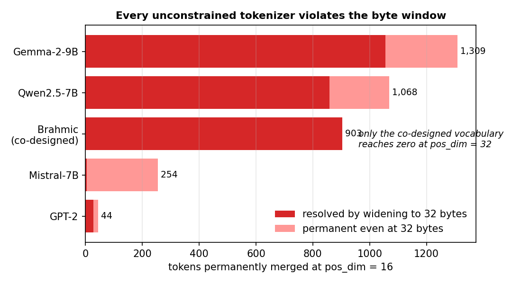
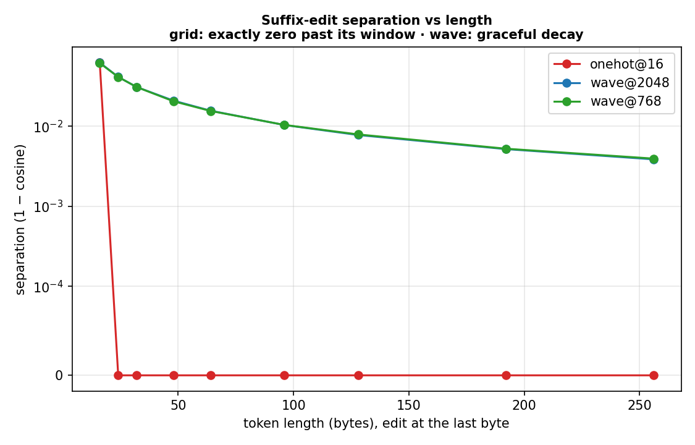
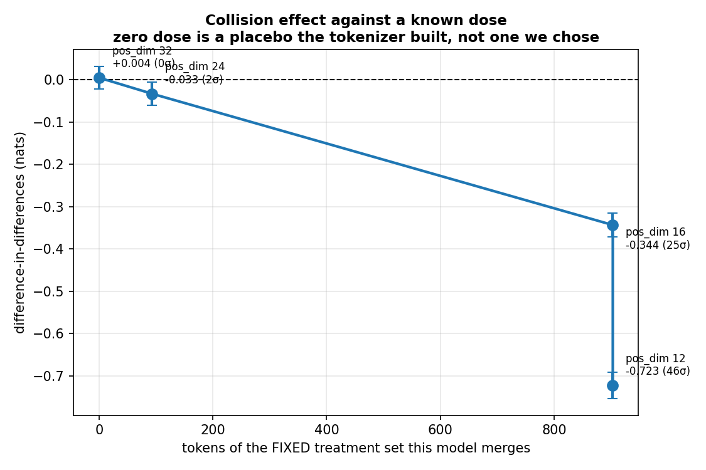
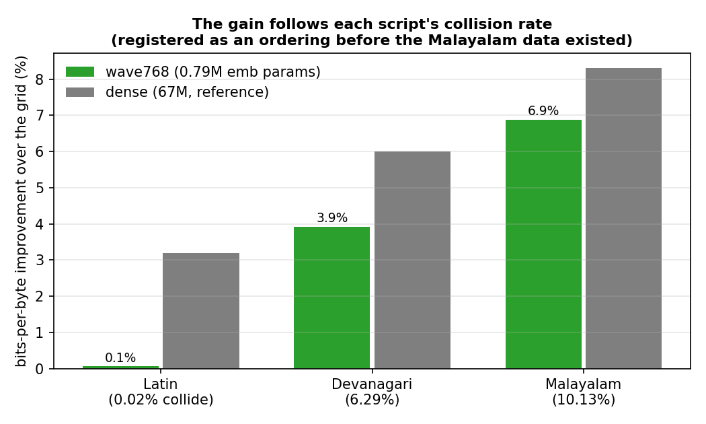
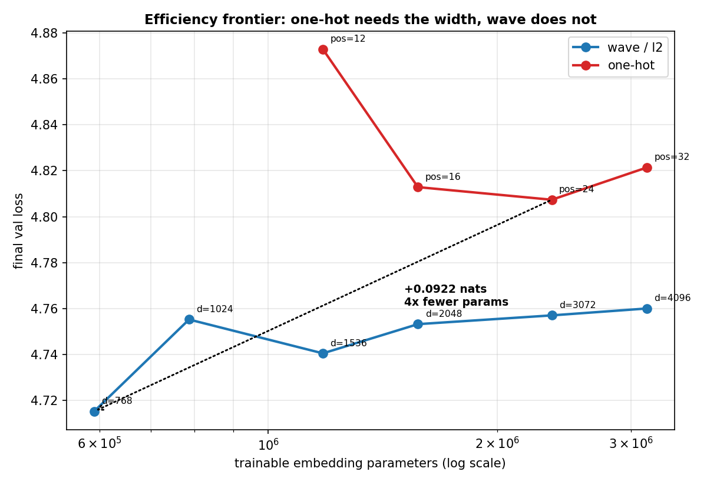
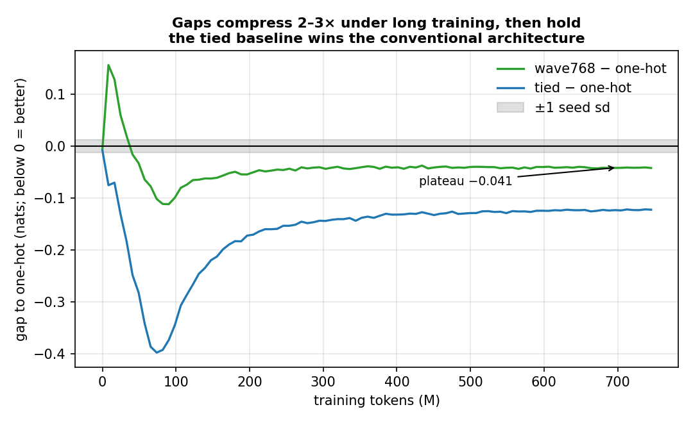

# Kronecker V2: The Byte-Window Constraint in Frozen Byte-Composed Embeddings

**Phase-coded byte embeddings, a causal account of truncation collisions, and an honest accounting of when the codec matters.**

Interactive demo: [abi2024.github.io/kronecker_v2](https://abi2024.github.io/kronecker_v2/) · Evidence sheets: [M1](results/M1_FINDINGS.md) · [M2](results/M2_FINDINGS.md) · [M3](results/M3_FINDINGS.md) · [M4/M5](results/M4_M5_FINDINGS.md) · [M6](results/M6_FINDINGS.md) · [Stability](results/MSTAB_FINDINGS.md) · [Seeds](results/SEEDS_FINDINGS.md)

---

## At a glance

- **The 32-byte window is a hidden tokenizer constraint.** The reference vocabulary passes it only because it was built to; every unconstrained vocabulary we audited (Gemma, Qwen, GPT-2, Mistral) fails it.
- **Collisions are causal**, dose-dependent, and information-bound — and the cost lands on whichever scripts spend the most bytes per character.
- **The receipt:** the tokens " सरकार" (*government*) and " सरकारी" (*governmental*) receive identical vectors under the grid at pos_dim=16. Swapping one for the other in real validation contexts changes the trained baseline's outputs by **exactly 0.0**; an unrelated swap moves them by 14.8. The wave code separates both.
- **The phase code removes the window** and matches a learned factorization at 37% of its parameters — but a **tied-embedding baseline beats every frozen codec in conventional architectures**; the codec's parameter story is specific to designs with no output head.
- **Short-budget comparisons overstate every gap 2–3×** before plateauing — measured on 93-point training curves, and applicable to any comparison made near 1:1 token:parameter ratios.



## Abstract

Kronecker byte×position embeddings encode a token's first `pos_dim` bytes on a fixed grid; bytes past the window are dropped. We show this window is not a free parameter but a **tokenizer design constraint**: tokens sharing a truncated prefix receive permanently identical vectors, and the reference vocabulary avoids this at `pos_dim=32` only because it was built to (max token length exactly 32 bytes). At the reference paper's own `pos_dim=16`, 903 of 131,072 tokens collide — 98% of them Indic. Auditing five external tokenizers, **every unconstrained vocabulary carries permanent collisions even at 32 bytes**, and SentencePiece vocabularies additionally ship ~250 exact-duplicate byte strings (byte-fallback aliasing) that no byte codec can separate.

We establish the collision cost **causally**: it scales near-linearly with a fixed treatment set's merge rate across four window sizes and vanishes (0.3σ) at the tokenizer-built placebo; a natural experiment shows the penalty follows the *information* in the code, not its format — five architectures that can distinguish the merged tokens all rescue ~0.47 nats on collision contexts, while a random projection carrying the grid's exact information rescues 0.04. The cost lands on high-bytes-per-character scripts, ordered exactly as collision rates predict (Malayalam > Devanagari > Latin on the co-designed vocabulary; Cyrillic and Thai on Gemma and Qwen).

We replace the grid with a **phase-bound Fourier byte code** (fractional-power HRR): position enters as rotation, so no window exists. Ablations show 81% of its matched-width gain is representational spread rather than the Fourier construction; its distinctive property is achieving spread at low width — matching a learned rank-16 factorization at **37% of the parameter budget** and beating the grid's best setting by **0.078 (~4.4 sd) at 4× fewer embedding parameters** (three seeds, winner's-curse-corrected). Long-horizon training (750M tokens, 7.7× the comparison budget) contracts the codec's edge ~2.4× before it stabilizes at −0.041 nats, and a **tied-embedding baseline beats every frozen codec in the conventional architecture** — the codec's parameter case is specific to designs with no output head. Across all arms, short-budget gaps compressed 2–3× before plateauing, a calibration factor we propose applying to any embedding comparison made near 1:1 token:parameter ratios.

Compute: one RTX 3060, ~60 GPU-hours total. Every headline claim was pre-registered; two registered predictions were falsified and are reported as such.

## Contributions

1. **The co-design constraint.** The byte window survives only where the tokenizer was built around it; the constraint's cost is paid upstream, invisible to the embedding's parameter accounting. Reproducible audit over any Hugging Face tokenizer, validated against a frozen control (§1).
2. **A causal, information-bound account of truncation collisions**: dose–response with a built-in placebo, an rp natural experiment, a bit-identical swap receipt on real contexts, and a 12σ replication on a vocabulary (Gemma) designed with no knowledge of this work (§2).
3. **Script-level fairness measurements** in bits per byte, ordered by each script's collision rate in all six arms tested (§3).
4. **A decomposition of the phase code's advantage** — spread vs. order-binding vs. width — via a 2×2 ablation with information held fixed (§4).
5. **An honest efficiency claim and its boundary**: −0.086 ± 0.007 over the grid paired across three seeds; parity with ALBERT at 37% of its budget; defeat by weight tying in conventional architectures; a stable long-horizon residual of −0.04 (§5).
6. **A budget-dependence measurement**: all gaps to baseline compress 2–3× between short-budget and plateau, quantified on 93-point curves (§6).
7. **The aliasing floor**: SentencePiece byte-fallback tokens duplicate single-character pieces (~250 per vocabulary, proven by id arithmetic) — a collision mechanism independent of the window that no byte codec, including ours, can fix (§1).

## Method

**Codec.** Each byte value has a fixed random phasor; position `p` multiplies its phase (fractional power encoding, after Plate's HRR). Bind by phase addition, bundle by summation, ℓ2-normalize. The codec is frozen; only a shared projection trains. Removing the rotation (a pure bag of bytes) makes anagrams identical and trains *worse than the grid* — order binding is load-bearing. The code is **suffix-preserving and capacity-limited with graceful degradation**, not losslessly unlimited: cosine separation of last-byte edits decays smoothly with token length (measured below; source artifact in results/stress/), whereas the grid is *exactly* blind to every edit past its window — cosine 1.0 to the last bit, and max |Δlogits| = 0 on collision swaps in trained models.

**Protocol.** Arms differ only in the embedding module: same tokenizer, data order, and body initialization, verified by a body-state hash. Matched trainable-parameter budgets (at d512: 2,097,152 → ALBERT rank 16, hash 3,584 buckets). Predictions registered in `results/RUNS.md` before each run. Determinism from NumPy PCG64 pins tables, codecs, initialization, and batch order — all verified by `verify_fingerprints.py`, a CI gate recomputing every table's SHA-256 against disk; CUDA *training trajectories* are not bit-reproducible (same-seed reruns vary by ~0.007), so all inference uses the measured cross-seed floors: **n=3 at both scales** (d384 ±0.0053–0.0168; d512 ±0.0117–0.0224). Differences under ~2 seed-sd are reported as unresolved.



## Results

### 1 · The window is a tokenizer constraint, and no unconstrained vocabulary satisfies it

| tokenizer | vocab | collided @16 | @32 | of which duplicates |
|---|---:|---:|---:|---:|
| Gemma-2-9B (SP) | 256,000 | 1,309 | 254 | ~254 |
| Qwen2.5-7B (byte-BPE) | 151,665 | 1,068 | 209 | 0 |
| **BrahmicTokenizer-131K** *(co-designed)* | 131,072 | 903 | **0** | 0 |
| Mistral-7B (SP) | 32,000 | 254 | 250 | ~250 |
| GPT-2 (byte-BPE) | 50,257 | 44 | 17 | 0 |

Zero-at-32 is unique to co-design. Mistral's max token is 25 bytes, so its 250 collisions at `pos_dim=32` can only be **exact duplicate byte strings** — confirmed by id arithmetic (`<0xNN>` = id 3+NN in every sampled pair). These aliases sit under 13.5% of Gemma's token stream; near-benign, but unfixable by any byte codec, ours included. At `pos_dim=16` on the co-designed vocabulary: Malayalam loses 10.13% of its tokens, Devanagari 6.29%, Latin 0.02% — UTF-8 charges Indic scripts 3 bytes per character, and a conjunct like क्ष costs nine.

### 2 · The collision cost is causal, information-bound — and holds to the last bit

Collisions corrupt a token *as context*, so the measurement is loss on positions following a treated token, against a control provably distinct at every window in the sweep, differenced. Holding the same 903 tokens fixed across four window sizes:

| of the set merged | DiD | σ |
|---:|---:|---:|
| 100% (pos_dim 12) | −0.7226 | 46 |
| 100% (16) | −0.3436 | 25 |
| 10.3% (24) | −0.0333 | 2.4 |
| **0% (32)** | **+0.0045** | **0.3** |

Near-linear in dose; zero at the placebo the *tokenizer* built. The mechanism is the information, not the format: dense, ALBERT, hash, and both wave widths all rescue ~−0.47 on collision contexts, while **rp — the grid's exact information, densified — rescues −0.044**. The effect replicates at 12.1σ on Gemma's vocabulary, on Cyrillic tokens we did not choose.

**The receipt** (`results/stress/stress_report.json`): in the trained baseline, swapping " सरकार" → " सरकारी" (693 real validation contexts sampled) changes the logits by **max |Δ| = 0.000e+00 — bit-identical forwards**, while swapping in a length-matched distinct token moves them by 14.8. The wave arm distinguishes both (9.0 / 12.3). The model does not merely struggle with these words; it provably cannot tell them apart.



### 3 · The cost lands where collision rates say it will

Relative bits-per-byte gain over the grid, all six M3 arms, ordered as registered before the Malayalam data existed:

| | Latin (0.02% collide) | Devanagari (6.29%) | Malayalam (10.13%) |
|---|---:|---:|---:|
| wave768 | −0.06% | −3.9% | **−6.9%** |
| dense (32× params) | −3.2% | −6.0% | −8.3% |

At matched width the frozen codecs are slightly *worse* than the grid on Latin; the aggregate win is a high-bytes-per-character story. On external vocabularies the victims are Cyrillic (Gemma) and Thai (Qwen): the window tax is universal, the currency depends on vocabulary composition. Bits per byte is the only cross-tokenizer axis — Qwen's per-token loss is 39% lower than Gemma's on the same text while its per-byte cost is *higher* (1.181 vs 1.159).



### 4 · Most of the matched-width gain is spread, not Fourier structure

The grid's code concentrates energy in ~15 of 4,096 effective dimensions; the wave code spreads over ~1,000. Passing the grid's code through a fixed invertible Gaussian (`rp`: identical information, collisions included) recovers **81% of the wave code's gain**, and at matched width rp and wave are indistinguishable — replicated at a second scale. Removing order (`bag`) lands below the grid. The construction needs both properties; the Fourier form's contribution at full width is nil.

### 5 · Where the codec matters — and where it loses

What the phase construction buys is **spread at low width**. All five core contrasts are now three-seed paired measurements:

| contrast (paired, 3 seeds) | mean ± SE | t |
|---|---:|---:|
| wave768 − one-hot, d384 | **−0.0860 ± 0.0069** | 12.4 |
| wave768 − one-hot, d512 | −0.0916 ± 0.0154 | 6.0 |
| ALBERT − one-hot, d512 | −0.0907 ± 0.0045 | 20.1 |
| wave768 − ALBERT, d512 | −0.0009 ± 0.0142 | 0.1 (tie) |

wave768 reaches parity with the learned rank-16 factorization at **786K parameters against ALBERT's 2.1M**, and beats the grid's own best setting by 0.078 (~4.4 sd). Under long-horizon training the edge over the grid contracts from −0.0995 (98M tokens) to a plateau of **−0.041**, flat within ±0.0008 over the final 350M tokens: real, stable, modest.

**In a conventional untied architecture the codec is not the practical choice**: a tied-embedding baseline — a learned input representation borrowing the output head's parameters — beats the grid by −0.123 and wave768 by −0.081 at 745M tokens. Tying is undefined in output-head-free designs, which is precisely the architecture where byte codecs' parameter accounting becomes real (~10–12M total embedding cost against ~0.5B conventional at V=131K, d=4096). The codec's standing claims in conventional settings are structural: no `V` in its cost, no per-token state, compositional codes, and the collision/fairness results above.



### 6 · Short-budget comparisons overstate every gap

Across three arms and 93 evaluation points each, gaps to the baseline peak by 66–100M tokens and compress **2–3×** before plateauing (wave768: −0.0995 → −0.041; tied: −0.387 → −0.12). The early crossover (codec behind until ~1,200 steps, ahead after) replicated on a new corpus. Any embedding comparison near 1:1 token:parameter ratios should expect contraction of this order before its gaps become claims.



## Negative results and withdrawn claims

Kept in the main text because they are the credibility of everything above.

- *"The gap at 750M tokens retains ≥50% of its 98M value"* — **registered, failed** (41.6%).
- *"wave768 beats ALBERT"* — **registered, falsified**: a tie (sign flip at seed 1338), albeit at 37% of ALBERT's budget.
- *The original d384 efficiency point overstated its gap by +0.014* — the winner's-curse bias predicted from the sweep design (min-of-six at n=1), then **measured** once the seeds existed. The corrected figures are the ones above.
- *"Wave is insensitive to `pos_dim`"* — withdrawn at 1.5σ once seed noise was measured; the narrow-beats-matched *sign* is 4-for-4 across settings but individually unresolved.
- *"Hash embeddings lose overall" / "ALBERT beats wave@4096"* — downgraded to unresolved at the measured d512 noise floor (baseline sd 0.0224, 4× its d384 value: noise does not transfer down with scale).
- A contaminated control briefly produced a spurious 3.7σ placebo failure; the error, diagnosis, and fix are preserved in the M4/M5 sheet.

## Limitations

Three seeds on all five core contrasts; single seed on secondary arms. Same-seed CUDA reruns vary by ~0.007 (training is not bit-reproducible); all inference uses the larger cross-seed floors. One model family; 11–38M bodies; validation loss and BPB only — the axes where a dense table is strongest and the codec's structural properties (unseen tokens, robustness) are untested. BPB *levels* across scripts are corpus-confounded; the M6 cross-tokenizer BPB comparison is confounded by token-matched (byte-mismatched) training exposure. The aliasing floor's harmlessness is argued from emission rarity, not measured.


## Reproducibility

```bash
pip install -e . && pytest -q                 # 24 contract tests incl. the fingerprint gate
python experiments/m1_collision_audit.py --byte-source both     # 2 min, no GPU
python experiments/m6_tokenizer_audit.py                        # any HF tokenizer
python experiments/verify_fingerprints.py                       # tables vs disk (CI gate)
python experiments/stress_test.py                               # capacity curve + swap receipt
# training grids: configs/ has one YAML per arm; entry points chain by milestone
#   m2_tiny_train.py (frozen core) → m5_train.py → m3_train.py → mstab_train.py
python experiments/patched.py m2_bucket_analysis --bucket-by prev-collision --root results/m3 --data data/m3 --baseline m3_onehot
python experiments/m4_dose_analysis.py && python experiments/mstab_curves.py
```

Every figure regenerates from manifests and CSVs; none is hand-edited. Per-milestone commands, freezes, and registered predictions: the evidence sheets linked above.

## Repository

```
src/kronecker_v2/     codecs (grid adapter, wave, ablations, baselines), vocab,
                      collisions, embedding, model, tables, eval/bpb
experiments/          one thin runner per milestone; patched.py installs the
                      codec chain for any analysis; verify_fingerprints.py (CI)
configs/              one YAML per arm — arms differ only in the codec block
results/              evidence sheets, manifests, caches, run ledger (RUNS.md)
```

## Status

All lines of evidence are closed and frozen (tags `m1`–`m6-closed`, `mstab-closed`, `seeds-closed`). Active direction: **decoder compatibility for the phase code** — an unbinding decode head against the consolidated encoder–decoder (output-head-free) architecture, where this codec's parameter accounting is decisive rather than dominated by tying. Secondary: seed replicates of the tied arm, a byte-matched M6 corpus, and the structural axes (unseen-token handling, robustness) that conventional loss cannot see.