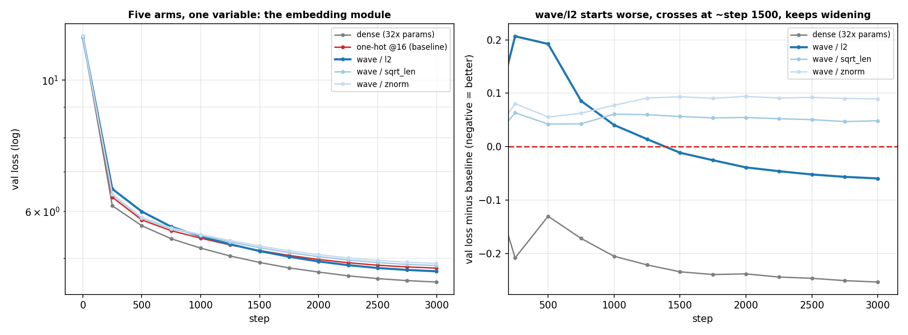
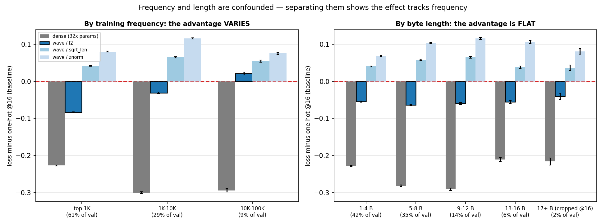
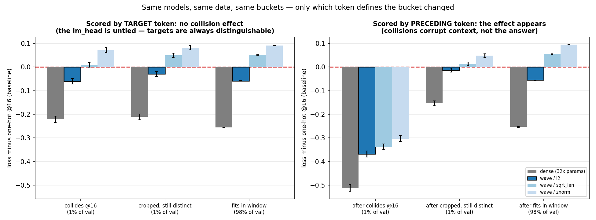
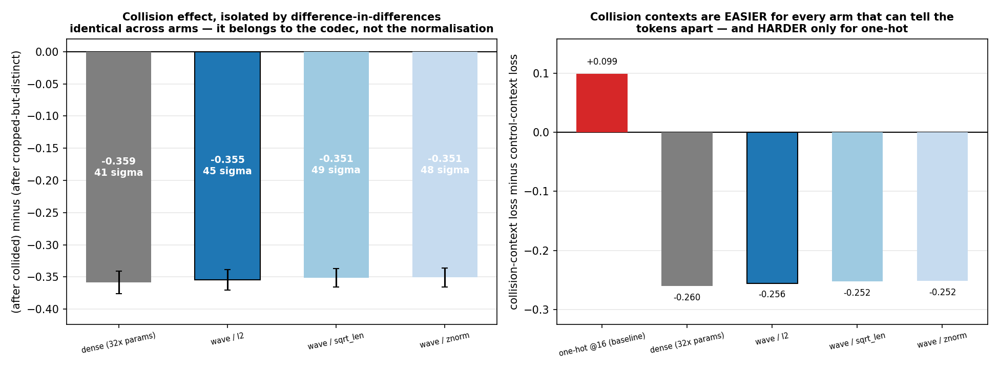

# Milestone 2 — Findings (FROZEN)

**Status:** CLOSED · 2026-08-14 · `git tag m2-closed`
**Pre-registered claim:** *best-norm wave reaches within 5% of one-hot's final
validation loss at matched steps, with no divergence.*
**Verdict: PASS, with the sign negative** — the best wave arm **beat** the
baseline by 1.24% at identical trainable parameter count.
**Cost:** 5 arms × 3,000 steps × 98.3M tokens, ~59 min each, ~4.9 h total on one
RTX 3060. Analysis: no additional training.

Every figure below regenerates from the CSVs on disk:
`python experiments/m2_figures.py`. No figure is hand-edited.

---

## 1. Setup

| | |
|---|---|
| model | 6 layer, 6 head, d_model 384 — 11.02M body + 50.33M lm_head |
| data | 98M train / 2M val tokens; ~50% FineWeb-Edu English + ~50% Sangraha Hindi |
| tokenizer | BrahmicTokenizer-131K, identical in every arm |
| schedule | 3,000 steps × 32,768 tokens (microbatch 4 × accum 8 × block 1024) |
| optimizer | AdamW, lr 6e-4, cosine to 10%, 200-step warmup, clip 1.0 |
| precision | bf16 autocast, fp32 master weights |

**Arms.** Four share an identical trainable parameter count (1,572,864 — the
`Linear(4096 → 384)` projection). The three wave arms share an *identical
codec*: 2048 complex phasors → 4096 real dims, byte value bound to byte position
by phase rotation. They differ in one line — how the bundled vector is scaled.

| arm | input path | embedding params |
|---|---|---:|
| `m2_onehot` | one-hot byte×position grid, pos_dim 16 | 1,572,864 |
| `m2_wave_sqrtlen` | phase codec, scaled by √(byte length) | 1,572,864 |
| **`m2_wave_l2`** | **phase codec, scaled to unit norm** | 1,572,864 |
| `m2_wave_znorm` | phase codec, mean/std normalised | 1,572,864 |
| `m2_dense` (reference) | learned 131,072 × 384 table | 50,331,648 |

**Controls verified, not assumed.** All five arms report
`body_state_hash = 4a6392274148` — every parameter outside the embedding
initialised bit-identically. All five drew batches from the same RNG stream, so
data order was identical. All five report `status: ok`. Parameter parity is
enforced by `tests/test_equal_params.py`, not asserted in prose.

---

## 2. Result



| arm | final val | vs one-hot | embedding params |
|---|---:|---:|---:|
| dense (reference, **not** matched) | 4.5592 | −5.27% | 50,331,648 |
| **wave / l2** | **4.7532** | **−1.24%** | 1,572,864 |
| one-hot @ pos_dim 16 (baseline) | 4.8129 | — | 1,572,864 |
| wave / sqrt_len | 4.8612 | +1.00% | 1,572,864 |
| wave / znorm | 4.9023 | +1.86% | 1,572,864 |

All three normalizations landed inside 2% of the baseline; none diverged; no run
produced a non-finite loss.

**Reading the units.** Loss is −ln(probability assigned to the correct token).
Step-0 loss of 11.86 is ln(131,072) — an untrained model spreading probability
evenly over the vocabulary. A gap of Δ nats means the better model assigns
e^Δ times more probability to the right answer: the 0.060 aggregate gap is 6.2%,
the 0.368 collision-context gap is 44%.

### Finding 1 — The phase code beats the one-hot grid at equal width

At identical input width, identical projection size, identical body init and
identical data order, `wave/l2` reaches lower validation loss than the one-hot
Kronecker codec. The only difference between those two runs is how a token's
bytes become 4,096 numbers.

### Finding 2 — The advantage is late-arriving and still growing at cutoff

Right-hand panel of Figure 1. `wave/l2` starts **worse** and overtakes near
step 1500:

| step | 250 | 500 | 750 | 1000 | 1250 | **1500** | 2000 | 2500 | 2999 |
|---|---:|---:|---:|---:|---:|---:|---:|---:|---:|
| l2 − one-hot | +0.207 | +0.192 | +0.086 | +0.041 | +0.014 | **−0.011** | −0.039 | −0.052 | **−0.060** |

Two consequences, and the second must appear in any writeup:

1. The gap widens monotonically from crossover to cutoff. Nothing has converged.
2. The result is therefore **budget-dependent**. A run stopped at 1,000 steps
   would have shown `wave/l2` losing. Never report the final number without the
   trajectory.

### Finding 3 — l2 is also the most stable

| arm | typical projection grad norm | max observed |
|---|---|---|
| one-hot | 0.8 – 1.3 | 2.53 (step 1380), 2.01 (1460), 2.01 (1700) |
| wave / sqrt_len | 0.4 – 0.6 | 3.24 (step 2040) |
| wave / znorm | 0.4 – 0.7 | ~0.95 |
| **wave / l2** | **0.13 – 0.20** | **~0.91** |

Final loss, stability, and trajectory — three independent grounds, not one.
**Normalization is locked to `l2` for M3 and M4.**

### Finding 4 — The honest counterweight: dense still wins

Dense reaches 4.5592, **4.08% better than wave/l2**, using **32× the embedding
parameters**. Its advantage is roughly constant through the second half of
training, neither closing nor widening. The defensible framing:

> At this scale the codec buys a 32× reduction in embedding parameters for about
> 4% of validation loss; and among codecs at equal width, the phase-bound Fourier
> code beats the one-hot grid outright.

Not "our embedding beats a dense table." It does not, here.

---

## 3. Where the advantage lives

An aggregate hides which of two worlds produced it: a codec slightly better
everywhere, or one identical almost everywhere and much better on a small slice.
These imply different papers. Re-scoring the finished checkpoints separates them
— no retraining, only re-reading the answer sheet with the questions sorted.



### Finding 5 — The advantage tracks frequency, not byte length

Frequent tokens are short tokens, so those variables are confounded and the
distinction matters: this project's thesis is about byte length.

| by training frequency | l2 − one-hot | | by byte length | l2 − one-hot |
|---|---:|---|---|---:|
| top 1K (61% of val) | **−0.084** | | 1–4 B | −0.054 |
| 1K–10K (29%) | −0.031 | | 5–8 B | −0.064 |
| 10K–100K (9%) | **+0.021** | | 9–12 B | −0.060 |
| | | | 13–16 B | −0.055 |
| | | | 17+ B (cropped) | −0.040 |

Frequency varies and crosses zero; length is flat. **The confound breaks in
frequency's favour.** The phase code's aggregate advantage is not a long-token
effect — 88% of it comes from the top-1K bucket alone (0.61 × 0.084 = 0.051 of
0.058). A prior prediction that dense's lead would shrink in the tail was
**falsified**: in absolute nats it grows (0.144 / 0.270 / 0.316), though in
relative terms it shrinks (4.46% / 4.48% / 3.46%).

---

## 4. The collision mechanism



### Finding 6 — Scored by target token, collisions appear to cost nothing

Bucketing by whether the **target** is one of the 903 tokens that share a
truncated byte string, `wave/l2` beats one-hot by −0.060 on collided targets and
−0.059 on ordinary ones. No effect. Worse, `dense − one-hot` is *smaller* on
collided targets (−0.221) than elsewhere (−0.256) — backwards, if collisions hurt.

That contradiction located the error. **The lm_head is untied and dense**: every
token keeps a private output row, so a collided token remains perfectly scoreable
*as an answer*. A collision corrupts a token *as context* — two sequences
containing कार्य and कार्यक्रम produce identical hidden states, so what degrades
is the prediction of whatever follows. Bucketing by target looks in the wrong
place.

### Finding 7 — Scored by the preceding token, the effect is large

Re-bucketing each scored position by the **input** token (same cached losses,
shifted one position; alignment verified as `inputs[p+1] == targets[p]`):

| bucket | positions | wave/l2 − one-hot |
|---|---|---:|
| after a collided token | 19,991 (1.00%) | **−0.368** |
| after a cropped-but-distinct token (control) | 22,457 (1.12%) | −0.013 |
| after an in-window token | 1,957,424 (97.9%) | −0.056 |

**Eleven times the target-side signal**, exactly where the mechanism predicts.

### Finding 8 — Attribution: difference-in-differences



−0.368 alone cannot attribute the effect: those positions follow tokens that are
collided *and* long *and* Indic *and* common. The control bucket shares three of
those four — tokens over 16 bytes that one-hot also crops, but whose truncated
form is **unique** (e.g. दिल्ली 19 B → ' दिल्ल', रोजगार 19 B → ' रोजगा';
887 such tokens). Long, Indic, cropped — but never ambiguous. Subtracting it
cancels everything the groups share:

| arm | after collided | after control | difference | σ |
|---|---:|---:|---:|---:|
| dense | −0.5121 | −0.1532 | −0.3589 | 41 |
| **wave / l2** | −0.3680 | −0.0134 | **−0.3546** | **45** |
| wave / sqrt_len | −0.3374 | +0.0137 | −0.3511 | 49 |
| wave / znorm | −0.3029 | +0.0480 | −0.3509 | 48 |

**The reported effect is −0.355, not −0.368.** The first is attributable; the
second is merely observed.

**Internal control against the obvious objection.** "Collided tokens are mostly
Indic — perhaps the codec is simply better at Indic." `sqrt_len` and `znorm`
**lose** to one-hot on ordinary positions (+0.055, +0.095) and on the control
(+0.014, +0.048) — which is also long and Indic — yet win by −0.337 and −0.303
after collided tokens. All four arms land within 0.008 of each other on the
difference-in-differences while their aggregate scores span 0.15 nats. **The
collision effect belongs to the codec (not truncating); the aggregate belongs to
the normalization.** Two independent dials, cleanly separated.

**The inversion** (right panel of Figure 4). Collided tokens are common words —
कार्य, सरकार, अधिकार — so what follows them is predictable:

| | after collided | after control | |
|---|---:|---:|---|
| dense | 3.3531 | 3.6130 | −0.260 **easier** |
| wave / l2 | 3.4973 | 3.7528 | −0.256 **easier** |
| **one-hot** | **3.8652** | 3.7662 | **+0.099 harder** |

Every arm that can distinguish those tokens finds such positions ~0.26 nats
easier. One-hot alone finds them **harder**. `wave/l2` recovers essentially all
of dense's advantage there (−0.256 vs −0.260) on positions where it otherwise
trails dense substantially.

### Finding 9 — Honest magnitude

Collision-affected positions are **1.00% of validation tokens**, so
0.0100 × 0.368 = 0.0037 nats — **6.3% of `wave/l2`'s aggregate advantage**.

> At pos_dim = 16, permanent collisions cost the one-hot codec 0.35 nats on
> affected positions; the phase code eliminates that cost entirely; and because
> such positions are 1% of the stream, this explains 6% of the overall
> improvement.

Stated in that order the claim is defensible. Under-claiming the aggregate is
what makes the mechanism claim credible.

---

## 5. Limits of these findings

- **One seed per arm.** M2 established direction and locked a hyperparameter; it
  is not a significance test on the aggregate. M4's three seeds are that test.
  (The bucket-level results are separately significant via paired SEs over
  ~2M positions.)
- **No convergence.** All curves were still descending at 3,000 steps; the
  wave/l2 gap was still widening. The comparison is budget-dependent.
- **One scale.** 11M body, 98M tokens. Nothing here transfers to frontier scale
  by assertion.
- **One metric.** Validation loss on in-distribution held-out text is the axis
  most favourable to a dense table. Typo robustness, unseen tokens, and
  vocabulary-independent cost are invisible to it and untested here.
- **One language pair.** English + Hindi. Other Indic scripts appear in the
  vocabulary but not meaningfully in the training mixture.

---

## 6. Freeze declaration — immutable entering M3

**FROZEN (code).** Changing any of these invalidates M2:

- everything frozen at M1 (codecs, audit tools, tests)
- `src/kronecker_v2/model.py` — the shared body; `wte` remains the only injected
  component
- `src/kronecker_v2/embedding.py` — frozen code buffer + single trainable projection
- `src/kronecker_v2/tables.py` — chunk-verified builders (every table
  self-verifies against the frozen per-token codec before the bf16 cast)
- `experiments/m2_tiny_train.py` — including the reseed after `wte` construction
  that keeps body init arm-independent
- `experiments/m2_bucket_analysis.py`, `experiments/m2_figures.py`

**FROZEN (constants).**

- `pos_dim = 16` ↔ `d_complex = 2048`; pairing rule `d_complex = 128 × pos_dim`
- wave normalization: **`l2`** (M2's output)
- byte source for training tables: `raw`
- microbatch 4 × grad_accum 8 = 32,768 tokens/step (sized to 12 GB; changing the
  split changes nothing scientific, but re-run `m2_bench.py` first)
- seed 1337 (body init), data_seed 42 (batch order)

**FROZEN (results).** `results/m2/summary.csv`, all four `buckets_*.csv` and
`buckets_*_gaps.csv`, every `manifest.json`, `log.csv` and `per_token_loss.npy`,
the five `console_*.log` files, `figures/fig1..fig4`, and
`results/m2_onehot_paging_incident.csv` (evidence for why the microbatch changed
mid-milestone).

**MUTABLE for M3.** Model size (30–50M), token budget, `configs/m3_*.yaml`, new
baseline arms (hash embeddings, ALBERT factorization), per-script bits-per-byte
(`src/kronecker_v2/eval/bpb.py`, still a stub), and multi-seed protocol.

---

## 7. Engineering lessons (each cost real time)

1. **A GPU can be 6× slow without erroring.** Peak allocation of 14.79 GB on a
   12 GB card made WDDM page to system RAM: `device=cuda`, no warning,
   4.5k tok/s. Always bench before an overnight grid.
2. **Gate the launch script on file existence.** One grid was lost because two
   scripts were never placed; the `&&` pre-flight now catches it.
3. **Write artifacts before printing them.** A `UnicodeEncodeError` on a Windows
   cp1252 console destroyed a completed report. `summary.csv` is written first.
4. **Line-buffer the log.** 240 steps of `log.csv` were lost to an unflushed
   buffer when a run was killed.
5. **Fix the colour map across plot panels.** Excluding the baseline from one
   panel restarts matplotlib's colour cycle and silently relabels lines.
6. **Measure the side the mechanism acts on.** The collision effect was invisible
   for one full analysis round because it was scored on targets, not context.

---

## 8. Reproduce

```bash
python experiments/m2_build_tables.py
python experiments/m2_prepare_data.py --hf --tokens 100_000_000
for a in onehot wave_sqrtlen wave_l2 wave_znorm dense; do
  python experiments/m2_tiny_train.py --config configs/m2_$a.yaml
done
python experiments/m2_report.py
python experiments/m2_bucket_analysis.py --bucket-by prev-collision   # scores + caches
for b in collision length frequency; do
  python experiments/m2_bucket_analysis.py --bucket-by $b             # instant
done
python experiments/m2_figures.py
```